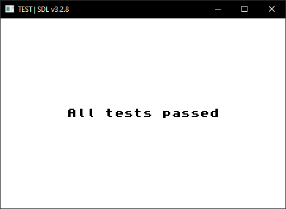

Ému microprocesseur ARM7TDMI.

Exemple d'utilisation :

    
GBA

    

        
        
        

*Que je partegerai plus tard.*
    

    
DS

    

        
        
        

*Encore trop de bugs pour être partagé…*
    

